# Meeting notes 

* Shu, Ioana, Yanlei
* 12-04-2017

## Main points
* Summary over the last week's remaining questions (OLAP operations over AnQ cube)
* Talk about query recommendations algorithms, how to go further

## Next 
* Reading the paper: **SEEDB**

> Next part is the support materials for this meeting

## OLAP operations over RDF graph data

### Idea

#### Relational data warehouse (traditional)
* construct analytical cube with a set of dimensions and measures
* typical OLAP operations: roll-up, drill-down, slice and dice (cube navigation, transforming a cube into another)

#### Heterogeneous RDF data in a DW setting
* analytical schema ($AnS$)[1], analytical schema instance[2], and analytical query ($AnQ$)[3]
* a cube $\leftrightarrow$ an $AnQ$
* OLAP operations: traditional OLAP operations on cubes $\rightarrow$ $AnQ$ rewritings (The definition of **Extended $AnQ$** is introduced[4])

#### Slice
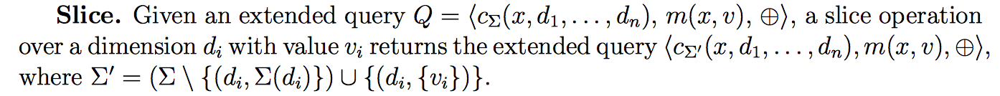

* Intuitively, slice operation binds an aggregation dimension to a concret value.
 
##### Example:
$Q$ be an extended query corresponding to the query cube of example 8:

$<C_{\sum}(x,a,c), m(x, y), count>$

with $\sum = \{(a, \{a\}), (c,\{c\})\}$ (classifier and measure queries are same)
A slice operation on the age dimension $a$ with a value 34 results in replacing extended classifier of $Q$ with:

$<c_{\sum'}(x,a,c)=\{c(x,34,c)\}>$

where:

$\sum'=\sum\setminus\{(a,\{a\})\}\bigcup\{(a,\{34\})\}$

#### Dice
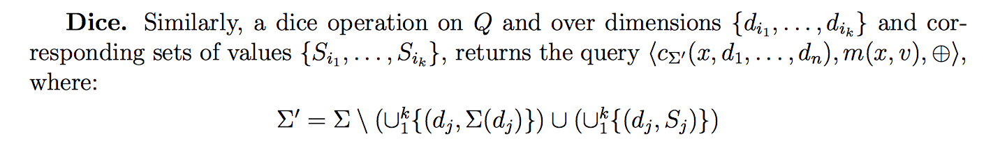

* Intuitively, dice operation forces several aggregation dimensions to take values from specific sets.

##### Example:
Similarly as the example above, but applying a dice operation on both age and city dimensions with values $\{34\}$ for age $(y_{1})$ and {Paris, Berlin} for location $(y_{2})$ by replacing the extended classifier of $Q$ with:

$<c_{\sum'}(x,a,c)=\{c(x,34,"Paris"),(x,34,"Berlin")\}>$

where:

$\sum'=\sum\setminus\{(y_{1}, \{y_{1}\}),(y_{2}, \{y_{2}\})\}\bigcup\{(y_{1},\{34\}),(y_{2},\{"Paris","Berlin"\})\}$

#### Roll-up/Drill-down
To define roll-up and rill-down operations, a new property call **nextLevel** is introduced to model the parent-child diemnsions in a hierarchy structure.

For instance:

* city $\rightarrow$ state $\rightarrow$ country $\rightarrow$ region
* isFriendWith $\rightarrow$ knows, isCoworkerOf $\rightarrow$ knows ...
* Example:
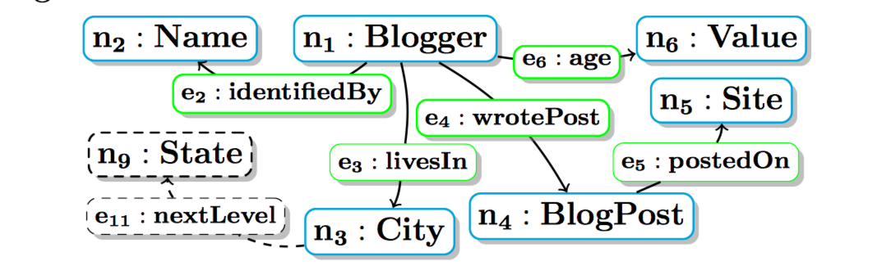

**Example: Adding a new node and edge to $AnS$**

Here, we added a new node $(n_{9})$ and a new edge $(e_{11})$ to illustrate the next level of **City** can be **State**.
 
Based on this, we can define roll-up/drill-down operations as **adding to/removing from the classifier, triple atoms** navigating such **nextLevel** edges.
* Example of roll-up, still using the previous example, from City to State, we got:

$<c'_{\sum'}(x,y_{1},y_{3}),m(x,z),count>$

where 

$c'_{\sum'}(x,y_{1},y_{3})\;:-\;x\;age\;y_{1},x\;livesIn\;y_{2},y_{2}\;nextLevel\;y_{3}$

* **Remarks** of the example above: the head and body of the query has changed!

##### Example:

#### Drill-in and Drill-out

* Drill-in and drill-out operations consist of adding and removing a dimension to the classifier.

##### Example (drill-in):
Consider the query: ask for the number of sites where each blogger posts, classified by the blogger's age and city:

$<c(x,y_{1},y_{2}),m(x,z),count>$

where the classifier and measure queries are defined by:

$c(x,y_{1},y_{2}):-\;x\;age\;y_{1},x\;livesIn\;y_{2}$

$m(x,z):-\;x\;wrotePost\;y,y\;postedOn\;z$

A roll up operation on the age dimension consists of removing the age dimension of the original classifier query:

$Q=<c'_{\sum'}(x,y_{2}),m(x,z),count>$

with:

$\sum'=\{(y_{2},\{y_{2}\})\} and c'(x,y_{2})=x\;livesIn\;y_{2}$

> ## References and notes
> * Dario Colazzo, François Goasdoué, Ioana Manolescu, Alexandra Roatis. RDF Analytics: Lenses over Semantic Graphs. 23rd International World Wide Web Conference, Apr 2014, Seoul, South Korea. 2014, <10.1145/2566486.2567982>. <hal-00960609>
> * Dario Colazzo, François Goasdoué, Ioana Manolescu, Alexandra Roatis. Warehousing RDF Graphs. Bases de Donn´ees Avanc´ees, Oct 2013, Nantes, France. 2013. <hal-00868616>

#### [1] Analytical Schema ($AnS$)
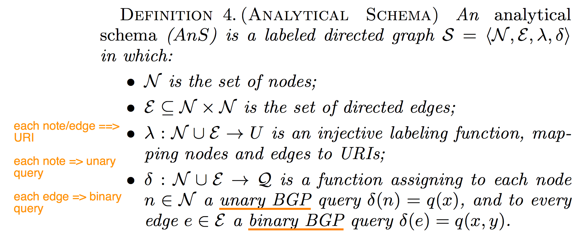

**Definition: Analytical Schema ($AnS$)**

* Example of $AnS$ - Graph
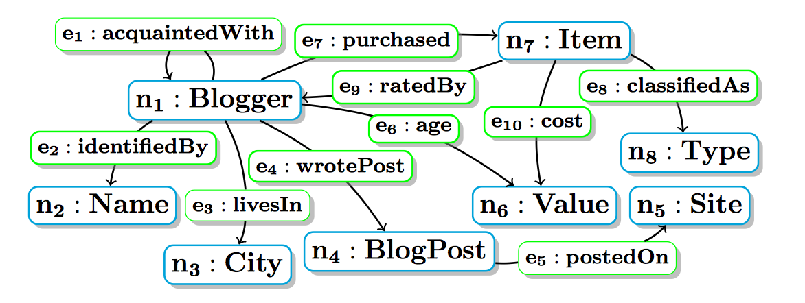

**Figure: An example of $AnS$ graph**

* Example of $AnS$ - **labels** and **queries** for the nodes and edges
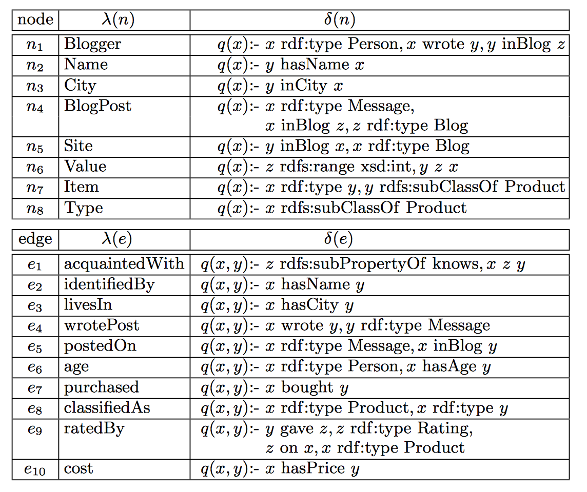

**Figure: labels and queries for the nodes and edges above**

#### [2] Anlytical Schema Instance
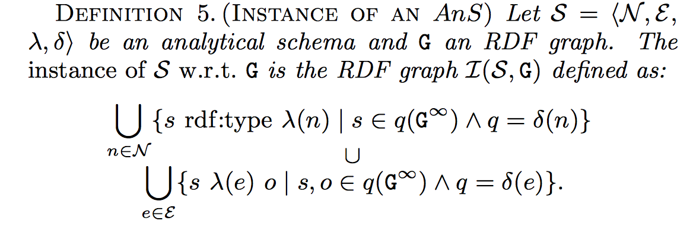

**Definition: Analytical Schema Instance**

* Example of $AnS$ instance
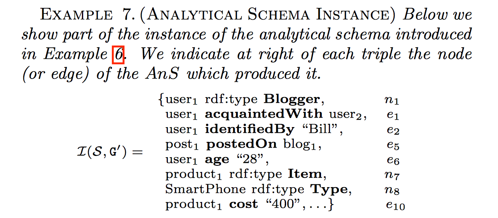

**Figure: an example of AnS instance**

#### [3] Analytical query ($AnQ$)
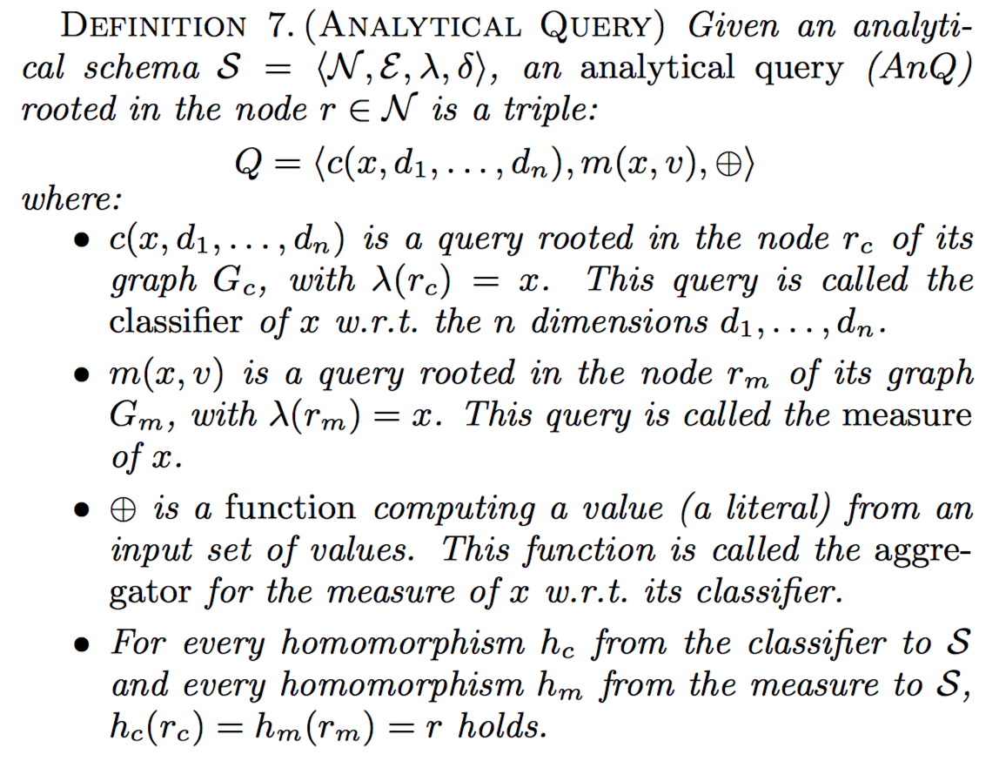

**Definition: Analytical Query**

* Example of $AnQ$
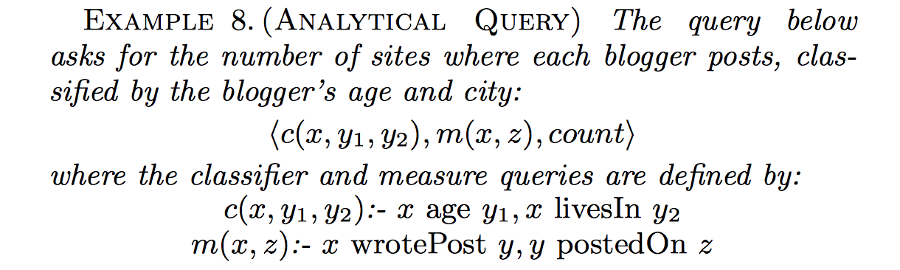

**Figure: an example of $AnQ$**

* AnQ answer 
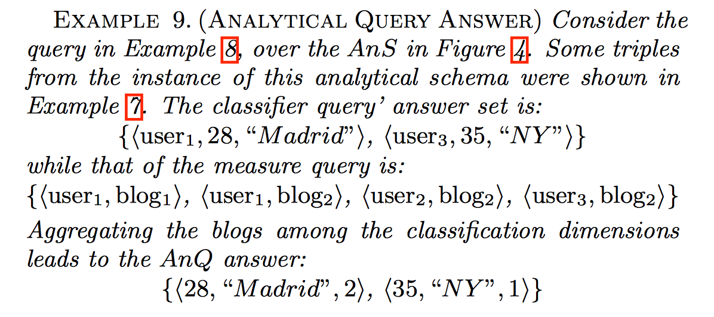

**Figure: an example of $AnQ$ answering**

#### [4] Extended $AnQ$
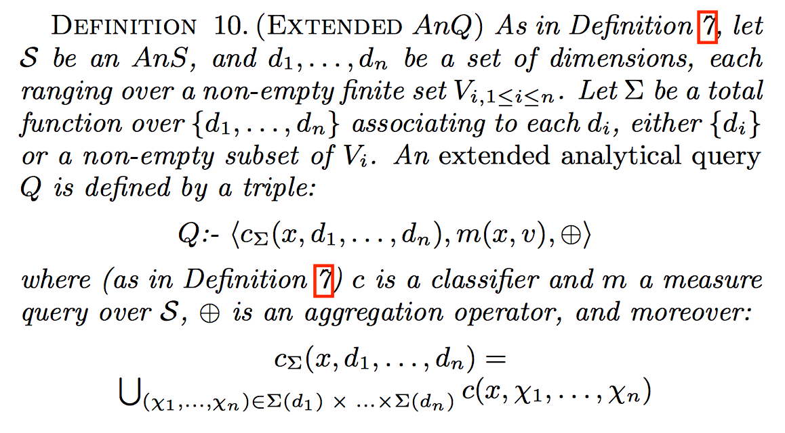

**Definition: extended $AnQ$**

	 

* **Remarks:**
	* $\sum$ is a total function that maps each $d_{i}$ over $\{d_{1},...,d_{n}\}$ to $\{d_{i}\}$ or a non-empty subset of $V_{i}$
	* $C_{\sum}(x,d_{1},...,d_{n})$ is the set of all possible classifiers by substituting each dimension variable $d_{i}$ with a value in $\sum(d_{i})$
	* The total function $\sum$ is like a **filter-clause**, which restricts the classifier result
	* Semantics of an extended AnQ: instead of picking tuples from c($I$), pick tuples from $c_{\sum}(I)$
	* An ordinary $AnQ$: an extended analytical query where $\sum$ only contains mapping pairs of the form ($d_{i}, \{d_{i}\}$)

