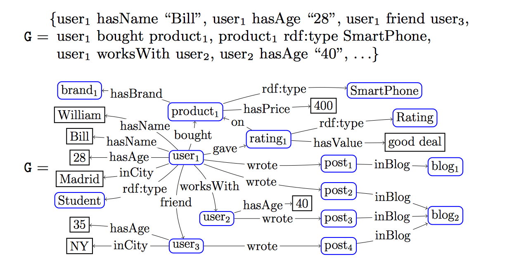
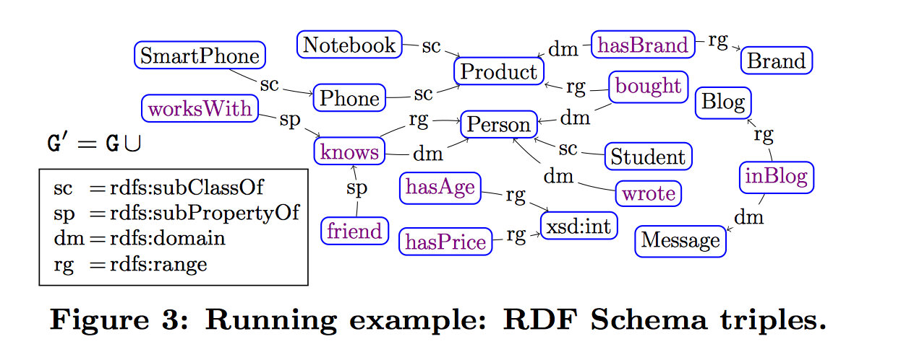
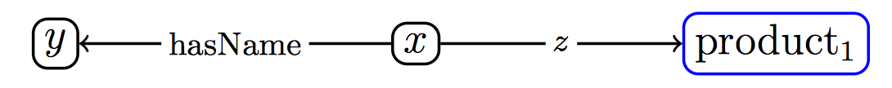
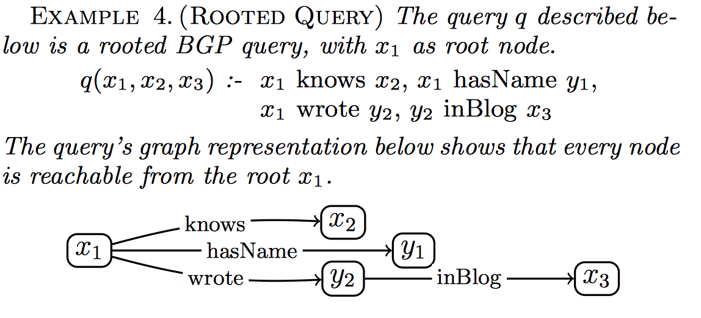
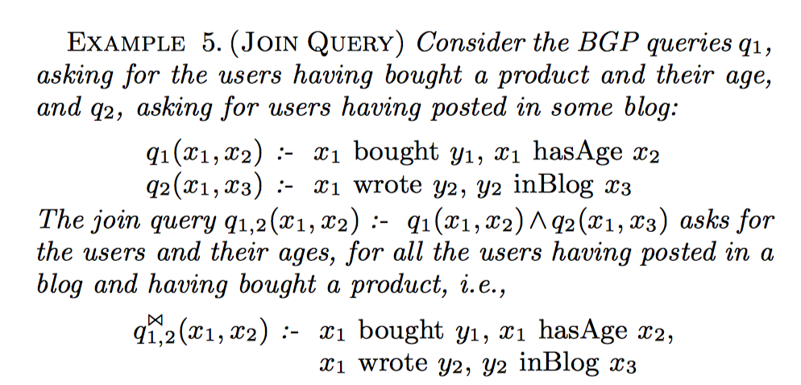
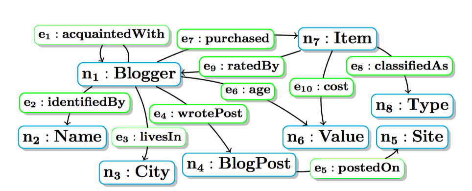
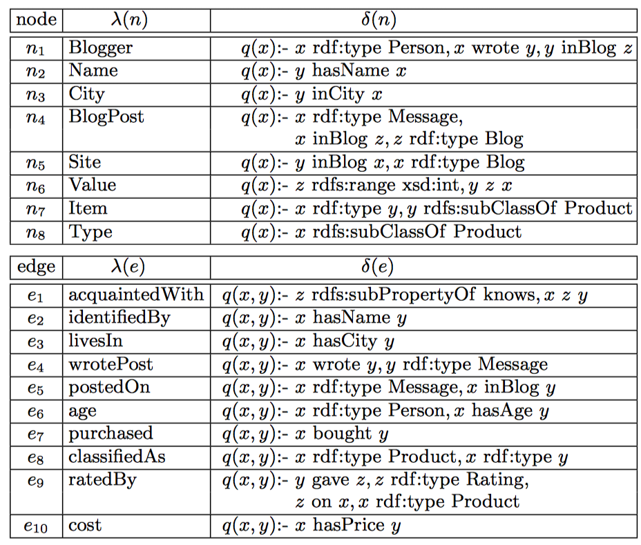
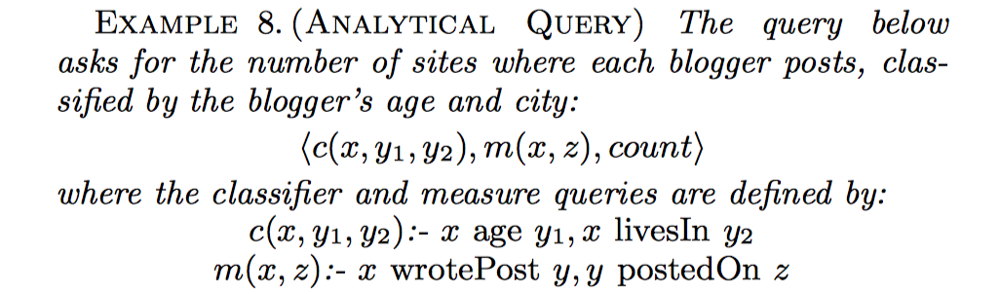

# Paper reading summary
**Paper**: RDF Analytics - Lenses over Semantic Graphs
**Authors**: Dario Colazzo, Fran¸cois Goasdou´e, Ioana Manolescu, Alexandra Roatis

## Problems
The development of semantic web (RDF) brings new requirements for RDF analytics tools and methods, going beyond semantic-rich analytics through warehouse-style tools.

Many systems that are capable of storing, querying, and updating RDF, such as OWLIM, RDF-3X, Virtuoso have been developped. However, as more and more datasets are made available, in particular Linked Open Data, application requirements also envolve, such as support for heterogeneous data, integrating RDF semantics and new aggregation methods.

This paper propose a complete formal framework for warehouse-style analytics on RDF data to solve these requirements.

## Context

To illustrate the requirements, the paper used an example of Alice. 

> Alice should build a click-map to show for each distinct region, "**the number of restaurants and their average rating per type of cuisine**"

* Data is heterogeneous (opening hours is available for some restaurants, but not all) ==> desgin a RDW
* merge other datasets (shops, museums...) ==> another star RDW
* the RDW does not capture the fact that a museum is a landmark (and other relationships present in the RDF)
* the relationship between the region and famous people related to it (using DBpedia, we can explore more, for instance *bornIn, gotMarriedIn*)
* a new type of aggregation (for instance, for each landmark, show how many restaurants nearby) ==> impossible for current RDW design as both *restaurant* and *landmark* are central entities, we can not use one as a measure for another

In general, to summarize, the application should: 
 
 * support of heterogeneous data
 * multiple central concepts
 * support for RDF semantics when querying the warehouse
 * the possibility to query the relationships between entities (similar to querying the schema)
 * flexible choice of aggregation dimensions

 
## Solutions
To meet these requirements and solve the problems, the authors proposed: 

* A full-RDF warehousing approach, the base data and warehouse extend are both RDF graphs
* **RDF Analytical Schemas** (**AnS**) (graphs of classes and properties themselves, having nodes(classes) and edges(properties) with no single central concept)
	* the core idea is to define each node(resp. edge) by an independent query over the base data
* **Analytical Queries** (**AnQ**) over the decentralized analytical schemas

Firstly, the paper recalled RDF graph data and queries.
### RDF graphs
* a set of triples of form **s p o**
* **Example of RDF graph**

**RDF graph Triples(top) and graph notation(bottom)**

### RDF Schema
* Designed to enhance the descriptions in RDF graphs
* RDFS triples declare semantic constraints between the classes and the properties used in the graphs 
* *dommain* and *range* denote respectively the first and second attribute of every property
* **Example of RDF Schema**

* From this schema, we can conclude semantic (or ontological) constraints like a Phone is a Product, a SmartPhone is a Phone, a Student is a Person,  working with someone is one way of knowing a person ... 

### RDF entailment 
* Implicit triples are also parts of the RDF graph, even though they are not explicitly present in it. (like here, SmartPhone is a Porduct, $product_{1}$ rdf:type Phone)
* Entailment mechanism: a set of explicit triples + some entailment rules ==> implicit RDF triples 
* A single application of an entailment rule is called immediate entailment
* **Saturation**: the immediate entailment rules allow defining the finite saturation (a.k.a clusure) of an RDF graph $G$, which is the RDF graph $G^{\infty}$

### BGP QUERIES
* BGP queries $\rightarrow$ SPARQL conjunctive queries (subset of SPARQL)
* a BGP is a set of triple patterns, or **triples** in short

#### BGP query graph
* Idea: to view each triple atom in the body of a BGP query as a generalized RDF triple, where variable may appear in any of the subject, predicate and object positions 
* This leads to a graph notation for BGP queries
* Example: 
	$
		q(x, y, z):-x\;hasName\;y, x\;z\;product_{1}
	$
	 
	can be represented by the graph:
	

#### Query evaluation and answering
* The evaluation of $q$ against $G$ uses only $G$'s explicit triples, thus may lead to an imcomplete answer set. So, we should evaluation $q$ against $q(G^{\infty})$

#### Rooted query and join query

**Rooted query example**

**Join query example**

### RDF Graph Analysis
#### Analytical schema and instance
* an analytical schema is the lens through which we analyze an RDF graph, an analytical schema $instance$ is analyzed with $analytical\;queries$
* a labeled directed graph

**Sample Analytical Schema**

* From a classical data warehouse analytics perspective: **each edge of the analytical schema represents a set of facts that may be analyzed.**
* From a Semantic Web perspective: **an analytical schema node corresponds to an RDF class, while an analytical schema edge connecting two nodes corresponds to an RDF property.**

**Labels and queries of some nodes and edges of the analytical schema**

* The classes and properties modeled by an $AnS$ are the ones visible to further RDF analytics, **analytical queries will be formulated against the $AnS$ and not against the base data.**

**Analytical Schema Instance**
* Schema produces instance 

#### Analytical queries
* a cube corresponds to an $AnQ$
* data warehosue analysis summarizes facts according to relevant criteria into so-called cubes
* An analytical query consists of two (rooted) queries and an aggregation function
	* classifier: defines the dimension $d_{1}, d_{2} ,..., d_{n}$ according to which the facts matching the query root will be analyzed
	* measure: according to which these facts will be summarized
	* aggregation: used to summarizing the analyzed facts
	* **an example:**

###Analytical query answering

#### The AnS materialization approach
* Idea: materializing the instance of the AnS and storing it within an RDF data management system (or RDF-DM, for short). The AnS instance itself is an RDF graph (GAV view). One can use RDF-DM to process the classifier, measure queries and the final aggregation.
* Problems: 
	* Storing the whole AnS instance 
	* Instance may need maintenance when the analyzed RDF graph changes

#### The AnQ reformulation approach

### OLAP RDF Analytics
* slice, dice, drill-in, drill-out
* slice: binding an aggregation dimension to a single value
* dice: dicing forces several aggregation dimensions to take values from specific sets
* drill-in, drill-out: adding and removing a dimension to the classifier

### Conclusion
This paper basically proposed a set of ways (the lens) through which we can specify and exploiting the RDF data warehouse by defining: 

* an analytical schema that captures the information of interest
* analytical queries (or cubes) over the 