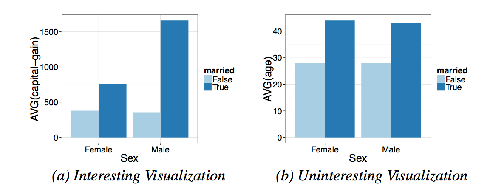
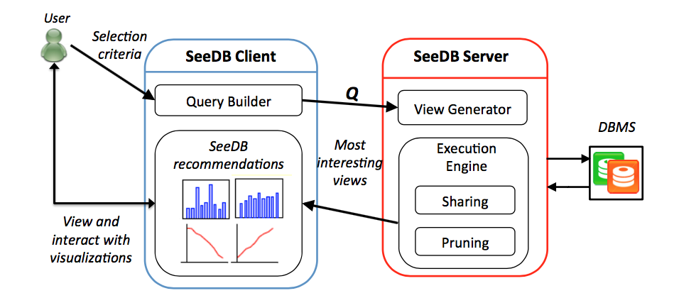

# Paper reading summary

Shu SHANG

**Paper**: SEEDB: Efficient Data-Driven Visualization Recommendations to Support Visual Analytics
**Authors**: Manasi Vartak (MIT), Sajjadur Rahman (UIUC), Samuel Madden (MIT), Aditya Parameswaran (UIUC), Neoklis Polyzotis (Google)

**Remarks**

* Fisrt version: 20/04/2017
* Second version: 24/04/2017 (reviewed 20/04/2017 with Ioana)

## Context 
This paper mainly proposed an visualization recommendation engine called **SEEDB**, which is designed to facilitate data exploration, especially data with high dimension properties (high-dimensional datasets).

To design such recommendation engine, two problems arise: **scale** and **utility**. Scale means that the engine should be able to compute the recommendation within interactive time scale (for instance, engine with too much latency will give experts a bad experience). Utility means that the engine should be able to propose a metric that can be used to measure the utility of visualizations proposed by the recommendation engine.

For scalability, the authors proposed two optimization mechanisms (sharing-based and pruning-based optimization). For the latter requirement, the authors proposed a utility metric based on deviation. 

At last, the authors showed some experimental results and a user study result to demonstrate the effectiveness of this method.

## Problem
When confronted with high-dimensional datasets, identifying the interestingness of a data visualization can be difficult because different dimensions and the combinations could explode the number of visualization that should be analyzed. 

So the core idea of this paper lie on a question: how to automatically identify and recommend interesting data visualization?

The interestingness of a visualization depends on plenty of factors, such as distribution, deviation, skewness... In this paper, a simple criterion based on deviation is proposed, a visualization is considered to be interesting if it shows a large deviation from some reference data (the detail will be shown in the **Solutions** part). 

However, there are also some other challenges if we use this utility metric. 

* Firstly, dataset with a small number of attributes could generate a large bench of visualizations, which takes time.
* Then, intuitively, evaluating each visualization based on this metric need to re-scan the underlying datasets over and over again, which is not optimal. 
* As the tool is a tool for exploratory analysis, slow accuracy may be trade-off at some times to follow a interactive speed.

## Motivation example
The authors introduced an example of millennial. The researchers want to find some interesting insight from relations between different indicators like **marital status** and **average income** or **marital status** and **average age**.

The figure above is an example. The left figure is more interesting as we can see: although the average income for un-married male/female is not important, the difference of average income is huge for married male/female. However, the figure in the right-hand side is less interesting as it shows less deviation for male/female with different marital status.

**PS**: The target dataset of this example is unmarried adults and the reference dataset is married adults. The deviation is thus defined between the target dataset and reference dataset. 

The goal of this paper is to build a system that uses deviation as a mean to identify the most interesting ones among a set of visualization candidates (although here the motivation example has only two candidates, the real case can be much more huge).

## Solutions 

### Annotations
$D$: database
$F$: the set of potential aggregate functions (count, ave...)
$A$: a set of dimension attributes that we can use to group by
$M$: a set of measure attribute that used to aggregate
$Q$: query Q, used to specify a subset of the dataset that an analyst wants to explore

* The class of query $Q$: select-project-join (SPJ) queries over the snowflake schema

$D_{Q}$: the result of Q over D

### SEEDB visualization
Each SEEDB visualization can be translated to **an aggregate over group-by query** over underlying data.

#### Annotation: 

$V_{i}$ $\leftrightarrow$ a visualization, represented by a triple $(a,m,f)$, where $m\in M,a\in A,f\in F$.
we call this an aggregate view, or simply $view$.

$V_{i}(D)$: the results of grouping the data in $D$ by $a$, and then aggregating the $m$ values using $f$.

#### Definition of utility via deviation
We have two datasets $D_{Q}$ (query dataset, target dataset) and $D_{R}$ (ref dataset), given a view $V_{i}$, the deviation-based utility is computed as follows:

We apply the $V_{i}$ to $D_{Q}$, get target view:

$Q_{T}$ = SELECT $a$, $f(m)$ FROM $D_{Q}$ GROUP BY $a$

Then we apply the $V_{i}$ to $D_{R}$, get reference view:

$Q_{R}$ = SELECT $a$, $f(m)$ FROM $D_{R}$ GROUP BY $a$

The two queries above are called **view queries**.

To ensure the aggregate operations get the same scale, we normalize each summary into a probability distribution. 

For instance, the proba distribution of the motivation example:

Average income v.s sex, the proba distribution for target view: 

$P[V_{i}(D)]$ is: (F: 0.52, M: 0.48)

	
For reference view:

$P[V_{i}(R)]$ is: (F: 0.31, M: 0.69)

However, average age v.s sex, the proba distribution for target view: 

$P[V_{i}(D)]$ is: (F: 0.5, M: 0.5)

For the reference view:

$P[V_{i}(R)]$ is: (F: 0.51, M: 0.49)

Average income v.s sex and Average age v.s sex are two different visualizations. We can qualitatively see that the distribution shows a larger diviation for the former one.

Formally, given an aggregate view $V_{i}$ and probability distribution for the target view and reference view, the utility $U$ of $V_{i}$ is defined as the **distance between these two proba distributions**. 

 $U(V_{i}) = S(P[V_{i}(D_{Q})], P[V_{i}(D_{R})])$

**Examples of distance functions:**

Earth Mover’s Distance, Euclidean Distance, Kullback-Leibler Divergence, Jenson-Shannon Distance

**SEEDB problem, the formal definition:**
Given a user-specified query $Q$ on a database $D$, a reference dataset $D_R$, a utility function $U$ as defined above, and a positive integer $k$, find $k$ aggregate views $V ≡ (a, m, f )$ that have the largest values of $U(V)$ among all the views $(a, m, f )$, while minimizing total computation time.

### System design
* front-end: support manually generate visualizations or obtain data-driven recommendations, human in the hoop
* SEEDB can viewed as a middleware layer on top of any DBMSs 
* SEEDB client is web-based, capturing user's input; SEEDB server produces output visualization, front-end renders the results

SeeDB architecture

The figure above shows the architecture. The most interesting part is the execution engine. Two optimization techniques are used in this part: sharing and pruning. A phased execution framework is designed to integrate the optimization methods: 

**a phased execution framework**

record1...1000 	**Phase1**
record1001...2000	**Phase 2**
....
record9001...10000	**Phase 10**
...

(Next paragraph is taken directly from the paper)
Each phase operates on a subset of the dataset. Phase i of n operates on the ith of n equally-sized partitions of the dataset. For instance, if we have 100, 000 records and 10 phases, the i = 4th phase processes records 30, 001 to 40, 000. The execution engine begins with the entire set of aggregate views under consideration. During phase i, SEEDB updates partial results for the views still under consideration using the ith fraction of the dataset. The execution engine applies sharing-based optimizations to minimize scans on this ith fraction of the dataset. At the end of phase i, the execution engine uses pruning-based optimizations to determine which aggregate views to discard. The partial results for each aggregate view on the fractions from 1 through i are used to estimate the quality of each view, and the views with low utility are discarded. The retained aggregate views are then processed on the i + 1th round, and the process continues. **In this manner, the set of views under consideration decreases across these phases, with all aggregate views at the start of the first phase, and only the k views left at the end of the nth phase.**

#### Sharing-based Optimizations
Each visualization is translated into two queries, for a particular user input, the queries evaluated by the system are similar: they scan the underlying data, differ only in the attributes used for grouping and aggregation.

Methods used: 
1. Combine Multiple Aggregates (same group-by, different aggregate)
2. Combine Multiple GROUP BYs (pay attention to memory usage)
3. Combine target and reference view query
4. Parallel Query Execution

#### Pruning-Based Optimizations
In fact, most visualizations are low-utiliy, computing too many these kinds of queries is wasting. Two ways:
1. Confidence Interval-Based Pruning (CI)
If the upper bound of the utility of view Vi is less than the lower bound of the utility of k or more views, then Vi is discarded.
2. Multi-Armed Bandit Pruning (MAB)
our goal is to find the visualiza- tions (arms) with the highest utility (reward), Successive Accepts and Rejects algorithm 

### Experimental results

#### Sharing optimizations 
The goal of these optimizations is to reduce the number of queries run against the DBMS and to share scans as much as possible between queries.

#### Pruning optimizations 
In pruning optimization part, besides latency (to measure if the optimization techniques work well), two additional metrics proposed: **accuracy** and **utility distance**

Distance function used -- [arth mover’s distance](http://homepages.inf.ed.ac.uk/rbf/CVonline/LOCAL_COPIES/RUBNER/emd.htm).

**Accuracy**: {$V_{T}$} the set of aggregate views with highest utility, {$V_{S}$} the set of aggregate views returned by SEEDB. The accuracy is defined as follows: 

$\frac{1}{|\{V_{i}\}|}\times|\{V_{T}\}\cap\{V_{S}\}|$

**Utility distance**: the difference between the average utility of $\{V_{T}\}$ and the average utility of $V_{S}$:

$\frac{1}{n}(\sum_{i}U(V_{T,i})-\sum(U_{S,i}))$

* The accuracy of pruning is **inversely proportional** to the difference between the **k-th** highest utility and the **k+1-st** utility

### Conclusion 
